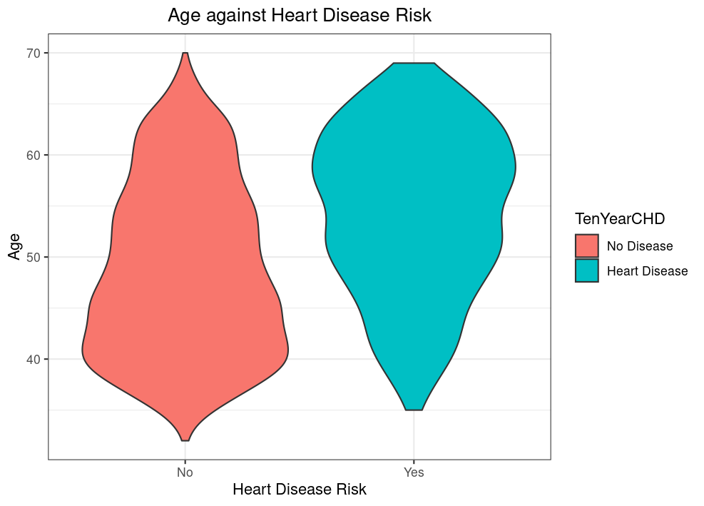

# Summary
Analysis showed that some of the most important predictors for ten year risk of coronary heart disease include gender, where men have a higher risk than women. Age was also significant factor as risk was more prevalent among older people. Number of cigarettes used per day showed increase in risk with more cigarettes per day. Others included: Hypertension, total cholesterol level, systolic blood pressure and glucose level.

Four models: Logistic regression, Linear Discriminant Analysis(LDA), Quadratic Discriminant Analysis(QDA) and K Nearest Neighbours(KNN) were used and compared to determine which was the most accurate model for this problem. The logistic model was the best performing model.

# Introduction
This is a report on the analysis of the factors that are associated with risk of future heart disease as well as predicting risk of heart disease using four different classification models: Logistic regression, Linear Discriminant Analysis(LDA), Quadratic Discriminant Analysis(QDA) and K Nearest Neighbours(KNN) . The dataset contains information on patients from Framingham, Massachusetts.

## Findings
### Age

The plot above shows the relationship between age and risk of coronary heart disease. Individuals who are older have a higher risk of coronary heart disease compared to their younger counterparts.

The plot below shows the distribution of age based on heart disease risk. We notice the large majority of younger people are in the no risk category and majority of older people are in the risk category.

### Blood Pressure

Higher blood pressure seems to be an indicator of having risk of future heart disease as shown in the two plots above where the average systolic and diastolic blood pressure is higher in cases with risk of heart disease. 

### Model Performance
The models were fitted using a training set which was a random sample of 70% of the dataset. Predictions were done using the remaining observations. We used PR(Precision Recall) curves to visualize the difference in each models performance and as they are also suitable for an imbalanced dataset and they also focus more on the positive class which is more critical in this classification problem.

From the PR curves we can see that the log model has the highest AUC(Area Under Curve) at 0.902 followed by KNN at 0.336 then QDA at 0.185 and lastly LDA at 0.149. This shows that the log model was significantly better than the other models. KNN was better than LDA and QDA but still had a low overall AUC score. QDA PR curve shows a steep drop in precision as recall increases very early on which shows the model predicted a lot of false positives. This is also similar in the LDA PR curve.

The Log model had the best performance of the four and we chose to proceed with that and chose a threshold of 0.22 as it provided the optimal F1-Score. This is the confusion matrix of the model at 0.22 threshold.

                     |           Predicted                 |
| Actual             | 0 (No Disease) | 1 (Heart Disease)  |
|--------------------|----------------|--------------------|
| 0 (No Disease)     | 764 (TN)       | 193 (FP)           |
| 1 (Heart Disease)  |  82 (FN)       | 105 (TP)           |

This shows that the model was fairly precise when it predicted positive with 72% accuracy but it missed on most actual positive cases as it was only able to capture 6% of the total positive cases.

# Conclusion
A lower threshold might be better when predicting since false negatives in this case could be very dangerous.

